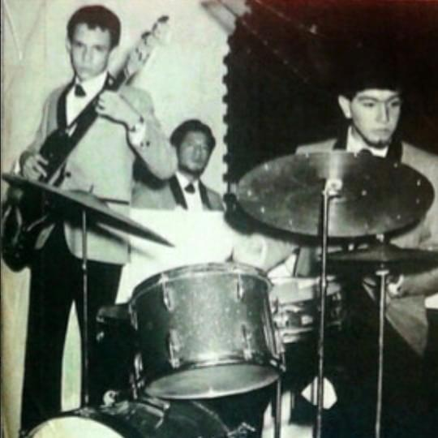

# Mr. Sold Out

Jose Romulo Sosa Ortiz, conocido como Jose Jose, fue un cantante y actor 
mexicano considerado un icono musical y popular del siglo XX. Su apodo 
_El Principe de la Cancion_, lo obtuvo de un programa de radio donde se 
comentaba sobre la cancion *El Principe*, de su album homonimo.

Nacido en una familia de musicos, Jose comenzo su carrera musical en su
adolescencia tocando la guitarra y cantando en serenatas. Mas tarde, se unio
a los PEG [Los PEG-Tristeza](https://www.youtube.com/watch?v=5EqsFbRqXGY),
un trio de jazz y bossa nova en el que canto y toco el bajo y el 
contrabajo 

Jose encontro el exito como solista a principio de la decada de los setenta
, demostrando su habilidad vocal con la iconica presentacion de la cancion 
*El Triste* [Video](https://www.youtube.com/watch?v=5yaenWbMXTQ) en el segundo 
Festival de la Cancion Latina.

